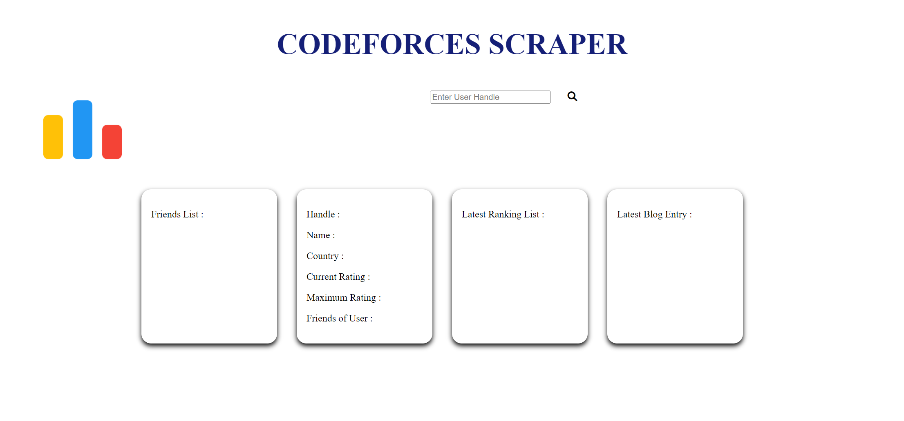
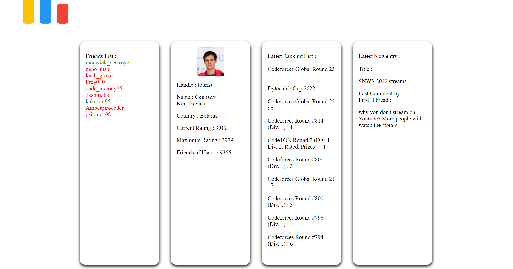
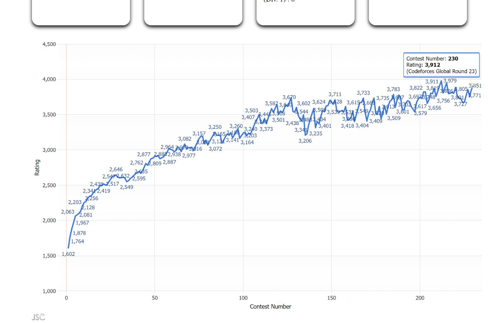

# Codeforces Scraper

A simple scraper which uses Codeforces API to get basic information about a user and also displays your online and offline friends.

## Tech Stack

HTML , CSS , JavaScript

## Screenshots

A search example

## 🚀 About Me

I'm an Electrical Engineering Sophomore at the Indian Institute of Technology, Roorkee. I have a deep interest in development. I'm also exploring Web 3.0 right now.

## 🔗 Links

